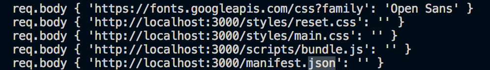

# Service worker

It is a piece of Javascript which gets stored/installed on your computer. After going offline, the webapplication should still behave as a live website based on URL and stored content in to the service-worker caches. Personaly I would describe it as the next level caching of websites.

## Manifest

The manifest is a file which includes information about the website you are going to cache. It is like a kind of meta.xml or condig.xml file, which contains the main/global information.

```JSON
{
  "name": "Map",
  "short_name": "Map",
  "description": null,
  "dir": "auto",
  "lang": "en-US",
  "display": "standalone",
  "start_url": ".",
  "background_color": "#000000",
  "theme_color": "#000000",
  "icons": [{
    "src": "/logo/logo.png",
    "sizes": "100x100",
    "type": "image/png"
  },{
    "src": "/logo/logo.png",
    "sizes": "200x200",
    "type": "image/png"
  }]
}
```

Manifest requires minimal to be accepted by lighthouse:
* Valid `name` property.
* Valid `short_name` property.
* Valid `start_url` property.
* A display property with the values standalone, fullscreen, or minimal-ui
* An icon that is minimal 192px width and height.
[Requirements](https://developers.google.com/web/tools/lighthouse/audits/install-prompt)
## Installing service worker


```JS
self.addEventListener("install", serverWorker.eventFunctions.install);
```

[install / oninstall](https://developer.mozilla.org/en-US/docs/Web/API/InstallEvent)
Listen to the installation `start` of itself. (not when it finished)

```JS
// {
    install (e) {
        e.waitUntil(
            caches.open(serverWorker.version.get())
            .then(cache => cache.add(
                "/offline/offline.html"
            ))
            .then(self.skipWaiting())
        );
    },
// }
```

When the install event triggers, it will give an installEvent back in to the first parameter.

---

#### Syntax `event.activeWorker`

```JS
const myActiveWorker = event.activeWorker
```
It has a property `activeWorker`, which contains the service worker object.
[ServiceWorker](https://developer.mozilla.org/en-US/docs/Web/API/ServiceWorker)

---

#### ExtendableEvent

The install event seems to contain the ExtendableEvent method, which is used to ensure that the objeect doesn't get destroyed inside of the function scope. It is saved in to the Global scope as a part of the service worker `lifecycle`. For more information: [ExtendableEvent](https://developer.mozilla.org/en-US/docs/Web/API/ExtendableEvent)

---

#### Syntax `event.waitUntil`

```JS
event.waitUntil(promise)
```

[event.waitUntil](https://developer.mozilla.org/en-US/docs/Web/API/ExtendableEvent/waitUntil)

This method tells the event that the work is ongoing. It can also detect when work has been done successfully. When it is used for service workers, the `waitUntil` method tells the browser that the work is not ended until the promise is finished. I am not sure if I am correct, but I think it keeps waiting until everything is done before cleaning up the event data.

---

#### Syntax `ServiceWorkerGlobalScope.skipWaiting`
```JS
ServiceWorkerGlobalScope.skipWaiting().then(function() {

});
```
[ServiceWorkerGlobalScope.skipWaiting](https://developer.mozilla.org/en-US/docs/Web/API/ServiceWorkerGlobalScope/skipWaiting)
The skipWaiting method is use to force the service worker to become active.


## Fetch and caching the incoming URL's + data.

```JS
self.addEventListener("fetch", serverWorker.eventFunctions.fetch);
```
Listen for incoming requests.

```JS
// {
fetch (e) {
    const request = e.request;

    serverWorker.log.url(request.url);

    if (request.mode === "navigate") {  
        e.respondWith(
            fetch(request)
                .then(response => serverWorker.cacheFile(request, response))
                .catch(err => serverWorker.fetchCoreFile(request.url))
                .catch(err => fetchCoreFile("/offline/offline.html"))
        );
    } else {
        const requestURL = request.url;
        const splittedURL = requestURL.split(".");
        const possibleExtension = splittedURL[splittedURL.length - 1];
        const acceptableExtensions = {
            "png": true,
            "jpg": true,
            "gif": true,
            "css": true,
            "js": true
        };
        if (possibleExtension != undefined && acceptableExtensions[possibleExtension]) { 
            e.respondWith(
                fetch(request)
                    .then(response => serverWorker.cacheFile(request, response))
                    .catch(err => serverWorker.fetchCoreFile(request.url))
            );
        } else {
            e.respondWith(
                fetch(request)
                    .catch(err => serverWorker.fetchCoreFile(request.url))
            );
        }
    }
}
// }
```


1. Split the URL on `.` and get the last part of the url.
```JS
const requestURL = request.url;
const splittedURL = requestURL.split(".");
const possibleExtension = splittedURL[splittedURL.length - 1];
```

2. Check if the extension is `png`, `jpg` or `gif`.
```JS
const acceptableExtensions = {
    "png": true,
    "jpg": true,
    "gif": true,
    "css": true,
    "js": true
};

if (request.mode === "navigate") {  
    //  main content
} else {
    if (possibleExtension != undefined && acceptableExtensions[possibleExtension]) { 
        // external files
    } else {
        //  any thing else which shouldn't be cached
    }
}
```

3. Fetch the request. If successfull then cache the file. If failed then try to get it from the cache.

```JS
    e.respondWith(
        fetch(request)
            .then(response => serverWorker.cacheFile(request, response))
            .catch(err => serverWorker.fetchCoreFile(request.url))
    );
```

[respondWith](https://developer.mozilla.org/en-US/docs/Web/API/FetchEvent/respondWith)

The `respondWith` method is used to prevent the browser it's default fetching behaviour. It gives you the ability to attach a promise to it, so that you can do the behaviour manually.

---

#### fetchCoreFile function/method

```JS
// {
    fetchCoreFile(url) {
        return caches.open(serverWorker.version.get())
            .then(cache => cache.match(url))
            .then(response => response ? response : Promise.reject());
    },
// }
```

This function/method makes use of the methods below and is used to get data from the cache.

---

#### cacheFile function/method

```JS
// {
    cacheFile(request, response) { 
        const clonedResponse = response.clone();
        caches.open(serverWorker.version.get())
            .then(cache => cache.put(request, clonedResponse));
        return response;
    }
// }
```

This function/method makes use of the methods below and is used to save data in the cache. The previous name of this function was cachePage, but because I am also using it for caching other files, it is changed to cacheFile.

---

#### Syntax `cache.match`
```JS
cache.match(request, {options}).then(function(response) {

});
```
[cache.match](https://developer.mozilla.org/en-US/docs/Web/API/Cache/match)

With the `cache.match()` method you can receive the data you have stored in your cache. It has requires one argument to be able to use, which is the `request` / key. There is also an optional argument options, which requires an object that contains information how you are going to match with your cache. For now(2018-03-28) it supports: `ignoreSearch`, `ignoreMethod`, `ignoreVary` and `cacheName`.

---

#### Syntax `caches.open`
```JS
caches.open(cacheName).then(function(cache) {
    // the cache is now open and available
});
```
[caches.open](https://developer.mozilla.org/en-US/docs/Web/API/CacheStorage/open)

This method gives you access to a requested cache. Once the promise is successfull, it will return the cache to you with `then`. It is located in the first parameter. 

The `caches` is a global and readonly variable, which comes from the `CacheStorage`.
[caches](https://developer.mozilla.org/en-US/docs/Web/API/WindowOrWorkerGlobalScope/caches)

---

#### Syntax `cache.put` 
```JS
cache.put(request, response).then(function() {
  // The response under the key request has been added to the cache.
});
```
[cache.put](https://developer.mozilla.org/en-US/docs/Web/API/Cache/put)

The `cache.put` method stores a value in the cache under a key. In this case it is the `request` as `key` and the `response` as `value`. When the `then` method is called, the value is stored successfully.

## Audit localhost


<details>
    <summary>
        Audit: service-worker not installed
    </summary>
    
    
</details>

#### Performance:
* First meaningful paint: 1480ms
* First Interactive (beta) 2450ms
* Consistently Interactive (beta) 2,450ms
* Perceptual Speed Index 3,124

#### Progressive Web App
* 55% (5/11)


<details>
    <summary>
        Audit: Installing service-worker
    </summary>
    
    
</details>

#### Performance:
* First meaningful paint: 1520ms
* First Interactive (beta) 2440ms
* Consistently Interactive (beta) 2,440ms
* Perceptual Speed Index 3,175

#### Progressive Web App
* 82% (2/11)


<details>
    <summary>
        Audit: service-worker is already installed
    </summary>
    
    
</details>

#### Performance:
* First meaningful paint: 1330ms
* First Interactive (beta) 2510ms
* Consistently Interactive (beta) 2,510ms
* Perceptual Speed Index 3,075

#### Progressive Web App
* 82% (2/11)


#### Why not test with `ngrok` instead?


Google Chrome doesn't let me... GRRRRRaudit


I tried this to solve the issue, but unfortunately not working.


## Understanding/debugging the incoming data.


#### Service-worker
```JS
fetch("/log", {
    body: request.url, // must match 'Content-Type' header
    cache: 'no-cache', // *default, no-cache, reload, force-cache, only-if-cached
    credentials: 'same-origin', // include, same-origin, *omit
    headers: {
        'user-agent': 'Mozilla/4.0 MDN Example',
        'content-type': 'application/x-www-form-urlencoded'
    },
    method: 'POST', // *GET, POST, PUT, DELETE, etc.
    mode: 'cors', // no-cors, cors, *same-origin
    redirect: 'follow', // *manual, follow, error
    referrer: 'no-referrer', // *client, no-referrer
});
```
[MDN using fetch API with posting](https://developer.mozilla.org/en-US/docs/Web/API/Fetch_API/Using_Fetch)


#### App (node.js)
```JS
app.post("/log", function (req, res, next) {
    console.log("req.body", req.body);
    next();
});
```


The problem with the webbrowser console is that you will lose some of your service-worker logs. So thought it was handy to debug the logs. First I tried to use XMLHttpRequest, but it seems it is removed and replaced with the fetch function.  
To send the logs I use the POST method to. After my first attempt I noticed that the type of content was URL, it didn't wanted to be send even thought it was stringified. So I decided to stop using the content type(JSON) `content-type': 'application/json'` and use the content type (URL) 
`application/x-www-form-urlencoded` instead. (even though I am sure that if I applied it correctly inside of the JSON, it might have been succeeded, but since it is only a URL, this method might be more performance wise.)


[Content-type for URL](https://stackoverflow.com/questions/4007969/application-x-www-form-urlencoded-or-multipart-form-data)


Requested files on visit.


Requested files after clicking a street with content.


## Service-worker cache version control

```JS
// {
    version: {
        versionValue: "1.0.0",
        get () {
            return this.versionValue;
        },
        set (version) {
            this.versionValue = version;
        }
    }
// }
```

It is very important to know that there will be a moment that some content gets old. So I thought it might be handy to add something to control the cache version. After creating this, I still have no idea what the best approach is to maintain this. But I will figure it out!


