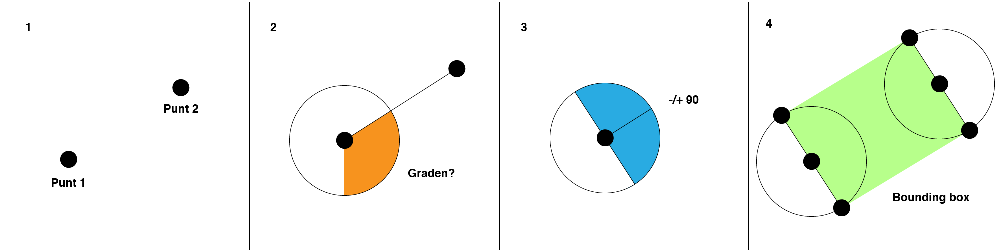

# performance-matters-server-side

## 

## Street selection boundingbox calculations


The street geo has multiple points. But to keep it simple, I will explain how it works with 2 points.

1. Start and end point.
2. Calculate the rotation between the points.
```JS
function findRotation( x1, y1, x2, y2 ) {
    let rotation = -(Math.atan2( x2 - x1, y2 - y1 ) * (180 / Math.PI) )
    return rotation < 0 ? rotation + 360 : rotation
}
```
[Lua find rotation function](https://wiki.multitheftauto.com/wiki/FindRotation)

3. Add and subtract 90 degrees.
4. Calcutate the offset, which will give you 2 extra positions. If you do that for both points, you will have 4 points, which can be seen as a boundingbox.
```JS
const rotOffset =  (rotation + (offsetIndex === 0 ? 90 : -90) * 3.141592653 * 2)/360;

const offset = 0.0001;

let 
    linePointX = x + Math.cos(rotOffset) * offset, 
    linePointY = y + Math.sin(rotOffset) * offset
;
```

## Render the streets

<details>
    <summary>Background map</summery>
    
</details>


Generate the the coordination/position strings for SVG polygon element and area element. The offsetIndex is used to indicate to which direction it should extend.
```JS
// ... 

            linePointX = imageX * (linePointX / coordBoundingSizeX);
            linePointY = (imageY * ((coordBoundingSizeY - linePointY) / coordBoundingSizeY));

            // Make the point strings            
            if (offsetIndex === 0) {
                coord = "," + linePointX + "," + linePointY + coord;
                polylineCoord = " " + linePointX + "," + linePointY + polylineCoord;
            } else {
                coord = coord + linePointX + "," + linePointY + ","
                polylineCoord = polylineCoord + linePointX + "," + linePointY + " "
            }
        }
    }
}
```


Remove the separators on the start and the end for both strings.
```JS
polylineCoord = polylineCoord.trim();

coord = coord.slice(1, -1);
```


Put everything together. Save the URI encoded in the URL.
```JS
return {
    areaElement: "<area shape=\"poly\" coords=\"" + coord + "\" alt=\"" + streetName.value + "\" href=\"" +  "/api/street-info/" + ( uri != undefined ? encodeURIComponent(uri.value) : "") + "\">", 
    svgElement: "<polygon fill=\"white\" stroke=\"white\" points=\"" + polylineCoord + "\"/>"};
```       


## Browserify

### Command to bundle the js:
```shell
browserify clientside_scripts/main.js -o public/scripts/bundle.js
```


### Require modules
```JS
const imageLoader = require("./image-loading-feedback");
const zeroState = require("./zero-state");
```